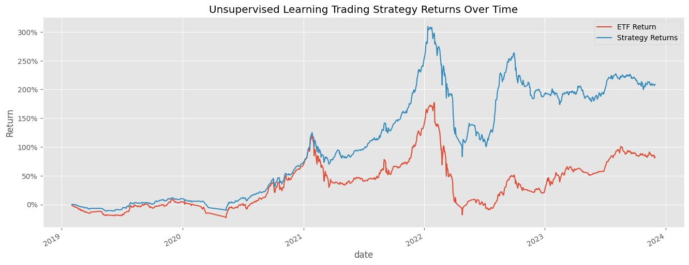

# Algorithmic Trading Strategy for the Colombo Stock Exchange (CSE)

This repository contains an algorithmic trading strategy for the Colombo Stock Exchange (CSE) using unsupervised learning. 📊

**Performance:** Our trading strategy outperformed an equal-weight ETF by 69.47% over a 5-year period.

**Methodology:** We selected the largest stocks by market capitalization in the CSE and applied K-Means clustering, optimizing a portfolio using the maximum Sharpe ratio. The aim was to potentially outperform market benchmark indices like an equal-weighted index of the top 150 CSE stocks. 📈

**Key Findings:**

## Data Preprocessing and Feature Engineering

The initial dataset required significant preprocessing, including handling missing values and removing stocks with insufficient data. 📂 We also performed comprehensive feature engineering to incorporate valuable technical indicators, including:

*   Garman-Klass Volatility
*   RSI & MACD
*   Bollinger Bands
*   ATR
*   Dollar Volume

## Principal Component Analysis (PCA)

PCA revealed that RSI and ATR were the most influential features: 🔄

*   RSI explained 27.55% of variance (PC1)
*   ATR explained 17.01% of variance (PC2)

Together, they explained 44.56% of total variance.

## Clustering Analysis

The optimal number of clusters (K=4) was determined using the elbow method and silhouette score. 💡 Clusters showed good separation when visualized using RSI and ATR as axes.

## Trading Strategy Performance

The portfolio constructed using our clustering strategy consistently outperformed the equal-weight market index. 🚀 Key success factors include:

*   Focus on stocks in cluster 3 (around RSI 70)
*   Portfolio optimization with the maximum Sharpe ratio
*   Dynamic monthly rebalancing
*   Diversification constraints

## Limitations and Considerations

The strategy relies heavily on technical indicators. Transaction costs and market impact weren’t considered. ⚠️
